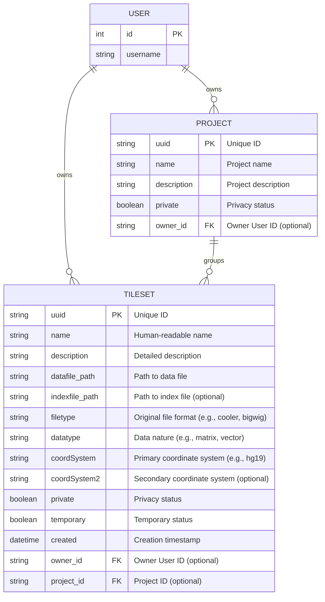

# HiGlass Server: Data Model

This document describes the core data models used within the HiGlass server, primarily focusing on `Tileset`, `Project`, and `User` entities.

## 1. Tileset Entity

The `Tileset` is the central entity for representing tiled genomic data.

### 1.1. Tileset Attributes

A `Tileset` has the following primary attributes:

| Attribute       | Type                               | Description                                                                                                | Notes                                                                 |
|-----------------|------------------------------------|------------------------------------------------------------------------------------------------------------|-----------------------------------------------------------------------|
| `uuid`          | String (CharField)                 | A unique identifier for the tileset.                                                                       | Max 100 chars, auto-generated (slugid), primary key for API access.   |
| `name`          | String (TextField)                 | A human-readable name for the tileset.                                                                     | Optional.                                                             |
| `description`   | String (TextField)                 | A more detailed description of the tileset.                                                                | Optional.                                                             |
| `datafile`      | File (FileField)                   | The actual data file that has been processed into tiles.                                                   | Path stored relative to server's media uploads.                       |
| `indexfile`     | File (FileField)                   | An optional index file associated with the `datafile` (e.g., `.tbi` for BAM, `.idx` for other formats).      | Optional.                                                             |
| `filetype`      | String (TextField)                 | The original format of the data file before tiling (e.g., `cooler`, `hitile`, `bigwig`, `bam`, `beddb`).     | Crucial for determining how to interpret and serve tiles.             |
| `datatype`      | String (TextField)                 | The nature of the data represented (e.g., `matrix`, `vector`, `gene-annotation`, `chromsizes`).            | Helps the client interpret the data. Default: "unknown".              |
| `coordSystem`   | String (TextField)                 | The primary coordinate system or genome assembly (e.g., `hg19`, `mm10`).                                   |                                                                       |
| `coordSystem2`  | String (TextField)                 | An optional secondary coordinate system, typically for 2D datasets.                                        | Optional, default: empty string.                                      |
| `owner`         | ForeignKey to User                 | The user who owns this tileset.                                                                            | Optional (can be anonymous). Used for permissions.                    |
| `private`       | Boolean                            | If `true`, the tileset is private and only accessible by the owner or users with explicit permissions.     | Default: `false`.                                                     |
| `project`       | ForeignKey to Project              | An optional project that this tileset belongs to.                                                          | Optional.                                                             |
| `temporary`     | Boolean                            | If `true`, indicates the tileset might be temporary (e.g., for short-term use).                            | Default: `false`.                                                     |
| `created`       | DateTime                           | The timestamp when the tileset record was created.                                                         | Auto-generated.                                                       |

### 1.2. Related Entities

*   **User:** Standard Django User model. A `Tileset` can have an `owner`.
*   **Project:** A `Project` can group multiple `Tilesets`. It has attributes like `uuid`, `name`, `description`, `owner`, and `private`.

### 1.3. Data Model Diagram (Mermaid ERD)

