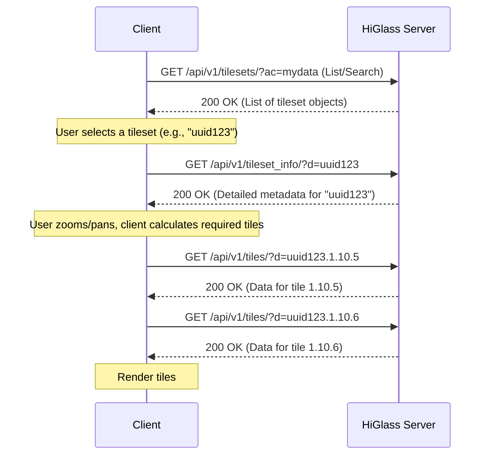

# HiGlass Server: Tileset API Endpoints

This document provides a comprehensive guide to the HiGlass Server API endpoints related to tilesets. All tileset-specific API endpoints are prefixed with `/api/v1/`.

## 1. Core Tileset API Endpoints

These endpoints provide the main RESTful interface for managing tileset collections and individual tileset resources.

### 1.1. Tileset Collection: `/api/v1/tilesets/`

This endpoint, managed by `TilesetsViewSet`, provides RESTful CRUD operations for tilesets.

#### `GET /api/v1/tilesets/`

Lists available tilesets, respecting user permissions and privacy settings.

* **Query Parameters:**
    * `ac=<string>`: Autocomplete filter by tileset `name`.
    * `t=<string>`: Filter by `filetype`.
    * `dt=<string>` (can be repeated): Filter by `datatype`.
    * `o=<field_name>`: Order results by a specific field (e.g., `name`, `created`).
    * `r=1`: Reverse the order specified by `o`.
    * Standard pagination parameters may apply (e.g., `page`, `page_size`).
* **Response:** `200 OK`
    * A JSON object containing:
        * `count`: Total number of tilesets matching the query.
        * `next`: URL for the next page of results (if paginated).
        * `previous`: URL for the previous page of results (if paginated).
        * `results`: An array of tileset objects. Each object generally follows the `UserFacingTilesetSerializer` structure:
            ```json
            [
              {
                "uuid": "string",
                "filetype": "string",
                "datatype": "string",
                "private": boolean,
                "name": "string",
                "coordSystem": "string",
                "coordSystem2": "string",
                "created": "datetime",
                "owner": "string (username)",
                "project_name": "string (name of associated project)",
                "project_owner": "string (username of project owner)",
                "description": "string"
              }
              // ... more tileset objects
            ]
            ```

#### `POST /api/v1/tilesets/`

Creates a new tileset. This is typically used for uploading files directly via the API.

* **Request Body:** `multipart/form-data` is expected if `datafile` (and optionally `indexfile`) is being uploaded.
    * `datafile`: The file to be ingested. **Required**.
    * `indexfile`: (Optional) The index file associated with `datafile`.
    * `filetype`: (String) The type of the file (e.g., `cooler`, `bigwig`). **Required**.
    * `datatype`: (String) The data type (e.g., `matrix`, `vector`). **Required**.
    * `name`: (String) Human-readable name for the tileset. Optional, defaults to datafile name.
    * `coordSystem`: (String) Primary coordinate system. **Required**.
    * `coordSystem2`: (String) Secondary coordinate system. Optional.
    * `uid`: (String) A specific UUID to assign. Optional, auto-generated if not provided. Must be unique.
    * `project`: (String) UUID of an existing project to associate with. Optional.
    * `description`: (String) Description for the tileset. Optional.
    * `private`: (Boolean) Set privacy status. Optional, defaults based on user.
* **Response:** `201 Created`
    * The newly created tileset object, similar in structure to the `GET /api/v1/tilesets/{uuid}/` response (likely including the `datafile` field path).

### 1.2. Single Tileset: `/api/v1/tilesets/{uuid}/`

Operations on an individual tileset, identified by its `uuid`.

#### `GET /api/v1/tilesets/{uuid}/`

Retrieves a specific tileset by its UUID.

* **Response:** `200 OK`
    * A JSON object representing the tileset, generally following the `UserFacingTilesetSerializer` structure (as shown in `GET /api/v1/tilesets/`).
    * If the tileset is not found or the user lacks permission: `404 Not Found`.

#### `PUT /api/v1/tilesets/{uuid}/`

Updates an existing tileset. Requires all fields to be sent.

* **Request Body:** JSON object containing all fields of the tileset to be updated. Similar to `POST` but for an existing resource. `datafile` updates might be handled differently or disallowed.
* **Response:** `200 OK`
    * The updated tileset object.
    * If not found: `404 Not Found`.

#### `PATCH /api/v1/tilesets/{uuid}/`

Partially updates an existing tileset. Only fields to be changed need to be sent.

* **Request Body:** JSON object containing a subset of fields to update.
* **Response:** `200 OK`
    * The updated tileset object.
    * If not found: `404 Not Found`.

#### `DELETE /api/v1/tilesets/{uuid}/`

Deletes a tileset and its associated media files.

* **Response:**
    * `204 No Content`: If successful.
    * `404 Not Found`: If tileset does not exist.
    * `403 Forbidden`: If user lacks permission.

## 2. Specialized Tileset API Endpoints

These endpoints provide specific functionalities related to tilesets, data retrieval, and server operations. They are essential for client applications like HiGlass to discover, configure, and display genomic data.

### 2.1. Get Tileset Information: `/api/v1/tileset_info/`

Retrieves detailed metadata for one or more tilesets. This information is crucial for client-side rendering engines (e.g., HiGlass viewer) to understand how to request and display tiles.

* **URL Path:** `/api/v1/tileset_info/`
* **HTTP Method:** `GET`
* **Authentication:** Session or Basic Authentication. User must have view permissions for the requested tileset(s).
* **Path Parameters:** None.
* **Query Parameters:**
    * `d=<uuid>`: (String, Required) UUID of the tileset. This parameter can be specified multiple times to fetch information for several tilesets in a single request (e.g., `?d=uuid1&d=uuid2`).
* **Request Body:** None.
* **Success Response:** `200 OK`
    * **Content-Type:** `application/json`
    * **Body:** A JSON object where each key is a requested tileset UUID. The corresponding value is an object containing tileset-specific metadata. The structure of this metadata varies significantly based on the `filetype` (e.g., `cooler`, `bigwig`, `hitile`, `beddb`, `bam`, `multivec`, `fasta`, `chromsizes-tsv`, `imtiles`, `geodb`) and `datatype` of the tileset.
    * **Commonly included fields in the metadata for each tileset:**
        * `name`: (String) Human-readable name of the tileset.
        * `filetype`: (String) The original file format.
        * `datatype`: (String) The type of data represented.
        * `coordSystem`: (String) The primary coordinate system (e.g., `hg19`).
        * `coordSystem2`: (String) The secondary coordinate system (if applicable).
        * `min_pos`: (Array of Numbers) Minimum genomic coordinates covered by the tileset (e.g., `[1]` for 1D, `[1, 1]` for 2D).
        * `max_pos`: (Array of Numbers) Maximum genomic coordinates covered.
        * `max_zoom`: (Integer) The maximum zoom level available for this tileset.
        * `max_width`: (Number) Maximum width of the data at the highest resolution, in base pairs.
        * `tile_size`: (Integer) For some vector tile types (e.g., `hitile`, `bigwig`, `fasta`), the number of data points or base pairs per tile.
        * `bins_per_dimension`: (Integer) For some matrix tile types (e.g., `cooler`), the number of data bins along one dimension of a tile (e.g., 256).
        * `chromsizes`: (Array of [String, Number]) For filetypes containing chromosome information (e.g. `bigwig`, `cooler`, `fasta`, `chromsizes-tsv`), an array of `[chromosome_name, size]` tuples.
        * `resolutions`: (Array of Numbers) For Cooler files, an array of available resolutions.
        * `shape`: (Array of Integers) For `multivec` files, indicates the dimensions of the vectors.
        * `max_tile_width`: (Integer) For `fasta` and `bam` files, a server-configured maximum width for a single tile request.
        * `mirror_tiles`: (String, Optional, e.g., `false`, `true`) For `imtiles`.
        * `transforms`: (Array of Objects, Optional) For `imtiles`, available image transforms.
    * **Example (conceptual for a Cooler matrix and a BigWig vector):**
        ```json
        {
          "matrix_uuid1": {
            "name": "My Hi-C Map",
            "filetype": "cooler",
            "datatype": "matrix",
            "coordSystem": "hg19",
            "min_pos": [1, 1],
            "max_pos": [249250621, 249250621],
            "max_zoom": 10,
            "bins_per_dimension": 256,
            "chromsizes": [["chr1", 249250621], ["chr2", 243199373]],
            "resolutions": [1000, 5000, 10000]
          },
          "vector_uuid2": {
            "name": "Signal Track",
            "filetype": "bigwig",
            "datatype": "vector",
            "coordSystem": "hg19",
            "min_pos": [1],
            "max_pos": [249250621],
            "max_zoom": 22,
            "tile_size": 1024,
            "chromsizes": [["chr1", 249250621], ["chr2", 243199373]]
          }
        }
        ```
* **Error Responses:**
    * If a requested `uuid` does not exist, the user lacks permission, or the filetype is unknown, an error object will be returned for that specific UUID (e.g., `{"error": "No such tileset with uid: ..."}` or `{"error": "Forbidden"}` or `{"error": "Unknown filetype ..."}`).
    * If no `d` parameters are provided, an empty JSON object `{}` is returned.
* **Core Logic:**
    1.  Initialize an empty dictionary `tileset_infos`.
    2.  For each `tileset_uuid` provided in the `d` query parameters:
        a.  Handle special case: If `tileset_uuid` is `osm-image`, return predefined OpenStreetMap tile metadata.
        b.  Attempt to retrieve the `Tileset` model instance from the database using `tileset_uuid`.
        c.  If not found, add an error entry to `tileset_infos` for this UUID and continue.
        d.  Check permissions: If `tileset.private` is true and `request.user` is not `tileset.owner`, add a 'Forbidden' error to `tileset_infos` and continue.
        e.  Based on `tileset.filetype`, call the appropriate `tileset_info` function from the `clodius.tiles` submodules (e.g., `hgco.tileset_info` for 'cooler', `hgbi.tileset_info` for 'bigwig', `hdft.get_tileset_info` for 'hitile', `cdt.get_tileset_info` for 'beddb', etc.).
            * These functions typically read metadata directly from the data file (e.g., `.cooler`, `.bigWig`, `.hitile`, `.beddb`, `.bam`, `.fasta`, `.multivec`, `.h5` for `imtiles`).
            * For `chromsizes-tsv`, it reads the TSV file.
            * For `elastic_search`, it makes an HTTP request to the configured URL.
        f.  If the `clodius` function returns successfully, augment the returned info with `name`, `datatype`, `coordSystem`, and `coordSystem2` from the `Tileset` model.
        g.  Store the resulting metadata in `tileset_infos` keyed by `tileset_uuid`.
        h.  If `tileset.filetype` is unknown, add an 'Unknown filetype' error.
    3.  Return `tileset_infos` as a JSON response.

### 2.2. Get Tileset Data: `/api/v1/tiles/`

Fetches actual data tiles for one or more tilesets at specified zoom levels and positions. This is the primary endpoint for data visualization.

* **URL Path:** `/api/v1/tiles/`
* **HTTP Method(s):** `GET`, `POST`
* **Authentication:** Session or Basic Authentication. User must have view permissions for the tileset(s) from which tiles are requested.
* **Path Parameters:** None.
* **Query Parameters (for GET requests):**
    * `d=<tile_id_string>`: (String, Required) Specifies the tile to fetch. The format is `<tileset_uuid>.<zoom_level>.<x_pos>[.<y_pos>][.<transform_type>]`.
        * `tileset_uuid`: (String) UUID of the tileset.
        * `zoom_level`: (Integer) The zoom level for the tile.
        * `x_pos`: (Integer) The X position (tile index) of the tile at the given zoom level.
        * `y_pos`: (Integer, Optional) The Y position of the tile (for 2D datasets like matrices).
        * `transform_type`: (String, Optional) A server-side transform to apply to the data before returning (e.g., `ice`, `kr` for cooler; `low-pass`, `stacked-bar` for others). Supported transforms depend on the data type and `clodius` capabilities.
        * This parameter can be repeated to fetch multiple tiles in one request (e.g., `?d=uuid1.0.1.2&d=uuid2.1.3.4`).
    * `raw=1`: (Integer, Optional) If `1` and only one tile is requested and it's an `imtiles` image tile, returns the raw image bytes (e.g., `image/jpeg`) instead of JSON.
* **Request Body (for POST requests):**
    * **Content-Type:** `application/json`
    * **Schema:** An array of objects, where each object specifies a tileset and the tiles/options for it.
        ```json
        [
          {
            "tilesetUid": "string", // Tileset UUID
            "tileIds": ["string"],   // Array of tile ID suffixes (e.g., "0.1.2", "1.3.4.ice")
            "options": {}            // Optional: A dictionary of options specific to this tileset's tile generation (passed to clodius)
          }
          // ... more tileset objects
        ]
        ```
* **Success Response:** `200 OK`
    * **Content-Type:** `application/json` (unless `raw=1` for a single image tile, then `image/jpeg` or similar).
    * **Body (JSON):** A JSON object where each key is a fully qualified requested `tile_id_string` (e.g., `uuid1.0.1.2`). The corresponding value is an object representing the tile data. The structure of this data is highly dependent on the `datatype`, `filetype` of the tileset, and the `clodius` library's output for that tile type.
        * Examples include dense or sparse arrays of numerical values, structured objects for annotations (e.g., BED-like entries), or base64 encoded image data for `imtiles`.
        * May include fields like `dense`, `sparse`, `min_value`, `max_value`, `dtype`, `image` (for `imtiles`).
    * **Body (Raw Image):** Raw image bytes if `raw=1` condition is met.
* **Error Responses:**
    * `400 Bad Request`: If too many tiles are requested (limit is `TILE_LIMIT=1000`). For POST, if the request body is not valid JSON or doesn't match the schema.
    * If a `tileset_uuid` within a `tile_id_string` does not exist, the user lacks permission, or tile generation by `clodius` fails for a specific tile, that `tile_id_string` will be omitted from the response, or its value might be an error object like `{"error": "Forbidden"}` or `{"error": "No such tileset..."}`. Errors are logged server-side.
* **Core Logic:**
    1.  Initialize `tileids_to_fetch` (set) and `tileset_to_options` (dict).
    2.  **Parse Request:**
        * For `GET`: Populate `tileids_to_fetch` from `d` query parameters.
        * For `POST`: Parse JSON body, validate against schema. For each entry, combine `tilesetUid` with `tileIds` to form full tile IDs and add to `tileids_to_fetch`. Store any `options` in `tileset_to_options`, including an MD5 hash of the options for caching.
    3.  Check if `len(tileids_to_fetch)` exceeds `TILE_LIMIT`. If so, return `400`.
    4.  Initialize `tileids_by_tileset` (defaultdict(set)), `generated_tiles` (list), `tilesets` (dict to cache Tileset model instances), `transform_id_to_original_id` (dict).
    5.  **Prepare Tile Fetching:** For each `tile_id` in `tileids_to_fetch`:
        a.  Extract `tileset_uuid`.
        b.  Retrieve `Tileset` model instance (use cached `tilesets` dict if available).
        c.  If `tileset.filetype` is 'cooler', normalize `tile_id` by ensuring a transform type is present (e.g., using `add_transform_type` which defaults to `hgco.get_transform_type`). Store mapping in `transform_id_to_original_id`.
        d.  Check Redis cache for the (potentially transformed) `tile_id` (append options hash to cache key if options exist). If found, deserialize with `pickle` and add to `generated_tiles`. Continue to next `tile_id`.
        e.  If not cached, add the (potentially transformed) `tile_id` to `tileids_by_tileset[tileset_uuid]`.
    6.  **Fetch Uncached Tiles:**
        a.  Create `accessible_tilesets`: a list of tuples `(Tileset_object, set_of_tile_ids_for_this_tileset, raw_flag, options_dict)` for tilesets where the user has permission (not private or owner).
        b.  Use `itertools.chain(*map(tgt.generate_tiles, accessible_tilesets))` to call `tilesets.generate_tiles.generate_tiles` for each accessible tileset and its tile IDs. This function, in turn, calls the appropriate `clodius` tile generation function based on filetype (e.g., `hgco.tiles`, `hgbi.tiles`, `ctb.tiles`, `hgim.tiles`).
        c.  Append results to `generated_tiles`.
    7.  **Process and Cache Generated Tiles:**
        a.  Initialize `tiles_to_return` (dict).
        b.  For each `(tile_id, tile_value)` in `generated_tiles`:
            i.  Extract `tileset_uuid`.
            ii. Cache `tile_value` in Redis (serialize with `pickle`), using `tile_id` (plus options hash if options exist) as key.
            iii. Get the `original_tile_id` using `transform_id_to_original_id`.
            iv. If `original_tile_id` was actually requested, add `tile_value` to `tiles_to_return` under `original_tile_id`.
    8.  **Format Response:**
        * If `len(generated_tiles) == 1`, `raw` flag is true, and `tile_value` contains an `image` key (for `imtiles`), return `HttpResponse` with raw image bytes and `image/jpeg` content type.
        * Otherwise, return `JsonResponse(tiles_to_return)`.

### 2.5. Other Utility Endpoints

The `tilesets/urls.py` also lists other utility endpoints:

* **`/api/v1/viewconf/`**: (`views.viewconfs`) Likely for managing HiGlass view configurations.
* **`/api/v1/suggest/`**: (`views.suggest`) For autocomplete suggestions, often for gene names or other annotations based on loaded tilesets.
* **`/api/v1/link_tile/`**: (`views.link_tile`) Potentially an internal endpoint used after S3 uploads to finalize tileset registration.
* **`/api/v1/chrom-sizes/`**: (`views.sizes`) To retrieve chromosome sizes for a given assembly.
    * `GET /api/v1/chrom-sizes/?id=<assembly_id>[&type=json|tsv][&cum=0|1]`
* **`/api/v1/available-chrom-sizes/`**: (`views.available_chrom_sizes`) Lists available chromosome size datasets (which are themselves special tilesets).

## 3. Common File Types and Data Types

Understanding these is key to using the API effectively.

**Common `filetype` values:**

* `cooler`: For Hi-C contact matrices.
* `hitile`: Generic 1D tiled data (often used for BigWig by Clodius).
* `bigwig`: Signal tracks.
* `multivec`: Multi-channel 1D signal tracks from HDF5.
* `beddb`: Tiled BED files for gene annotations or regions.
* `chromsizes-tsv`: Tab-separated file defining chromosome names and sizes.
* `bam`: Sequence alignment files (requires index).
* `fasta`: Sequence files.

**Common `datatype` values:**

* `matrix`: 2D data, like Hi-C maps.
* `vector`: 1D data, like signal tracks.
* `gene-annotation`: Genomic annotations, typically from BED files.
* `chromsizes`: Chromosome names and their lengths.
* `locusprofile`: Profiles of values around specific loci.
* `2d-rectangle-domains`: Rectangular annotations on 2D data.

## 4. Authentication and Authorization

* The API uses Django's authentication system (Session, BasicAuth).
* Access to tilesets and certain operations (create, update, delete) is governed by ownership (`owner` field) and the `private` flag of the `Tileset` and its associated `Project`.
* Anonymous users have limited access, typically only to public tilesets.

## 5. Workflow Example: Displaying a Tileset

A typical client workflow to display a tileset might involve:

1.  **List/Find Tileset:**
    * User searches or browses. Client calls `GET /api/v1/tilesets/` (possibly with filters).
    * Or, if UUID is known (e.g., from a shared view): Proceed directly.
2.  **Get Tileset Info:**
    * Once a `uuid` is selected, client calls `GET /api/v1/tileset_info/?d=<uuid>` to get metadata required for rendering (zoom levels, data bounds, etc.).
3.  **Fetch Tiles:**
    * As the user navigates/zooms the HiGlass view, the client determines which tiles are needed.
    * Client calls `GET /api/v1/tiles/?d=<uuid>.<zoom>.<x>.<y>` for each required tile.
4.  **Render Data:**
    * Client uses the tile data and tileset info to render the visualization.



